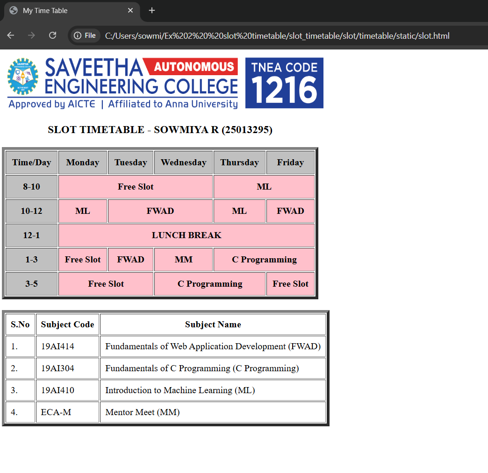

# Ex02 Time Table
## Date:12/05/26

## AIM
To write a html webpage page to display your slot timetable.

## ALGORITHM
### STEP 1
Create a Django-admin Interface.

### STEP 2
Create a static folder and inert HTML code.

### STEP 3
Create a simple table using ```<table>``` tag in html.

### STEP 4
Add header row using ```<th>``` tag.

### STEP 5
Add your timetable using ```<td>``` tag.

### STEP 6
Execute the program using runserver command.

## PROGRAM

<html>
    <head>
        <title>My Time Table</title>
    </head>
    <body>
        
        <table border="5" cellpadding="10">
            <caption><h3>SLOT TIMETABLE - SOWMIYA R (25013295)</h3></caption>
            <tr bgcolor="silver">
                <th>Time/Day</th>
                <th>Monday</th>
                <th>Tuesday</th>
                <th>Wednesday</th>
                <th>Thursday</th>
                <th>Friday</th>
            </tr>
            <tr align="center">
                <th bgcolor="silver">8-10</th>
                <th colspan="3" bgcolor="pink">Free Slot</th>
                <th colspan="2" bgcolor="pink">ML</th>
            </tr>
            <tr>
                <th bgcolor="silver">10-12</th>
                <th bgcolor="pink">ML</th>
                <th colspan="2" bgcolor="pink">FWAD</th>
                <th bgcolor="pink">ML</th>
                <th bgcolor="pink">FWAD</th>
            </tr>
            <tr>
                <th bgcolor="silver">12-1</th>
                <th colspan="5" bgcolor="pink">LUNCH BREAK</th>
            </tr>
            <tr>
                <th bgcolor="silver">1-3</th>
                <th bgcolor="pink">Free Slot</th>
                <th bgcolor="pink">FWAD</th>
                <th bgcolor="pink">MM</th>
                <th colspan="2" bgcolor="pink">C Programming</th>
            </tr>
            <tr>
                <th bgcolor="silver">3-5</th>
                <th colspan="2" bgcolor="pink">Free Slot</th>
                <th colspan="2" bgcolor="pink">C Programming</th>
                <th bgcolor="pink">Free Slot</th>   
            </tr>
        </table>
        <br>
        <table border="5" cellpadding="8">
            <tr>
                <th>S.No</th>
                <th>Subject Code</th>
                <th>Subject Name</th>
            </tr>
            <tr>
                <td>1.</td>
                <td>19AI414</td>
                <td>Fundamentals of Web Application Development (FWAD)</td>
            </tr>
            <tr>
                <td>2.</td>
                <td>19AI304</td>
                <td>Fundamentals of C Programming (C Programming)</td>
            </tr>
            <tr>
                <td>3.</td>
                <td>19AI410</td>
                <td>Introduction to Machine Learning (ML) </td>
            </tr>
            <tr>
                <td>4.</td>
                <td>ECA-M</td>
                <td>Mentor Meet (MM)</td>  
            </tr>
        </table>
    </body>
</html>


## OUTPUT


## RESULT
The program for creating slot timetable using basic HTML tags is executed successfully.
